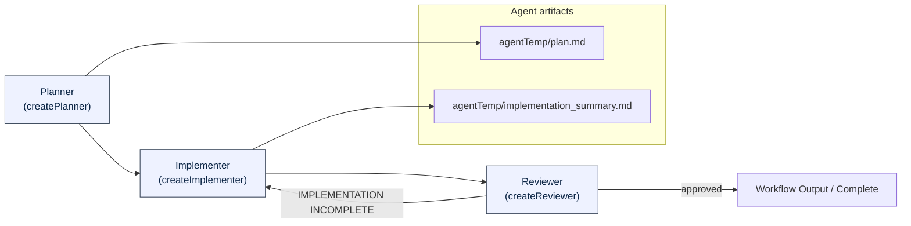

# Plan → Implement → Review Workflow

This repository includes a Plan → Implement → Review workflow implemented in
`src/workflow/plan_implement_review.py`. Below is a Mermaid diagram that
illustrates the high-level flow between the planner, implementer, and reviewer
agents.



Quick notes:

- The `Planner` creates `agentTemp/plan.md` (a checklist of tasks).
- The `Implementer` reads `agentTemp/plan.md`, implements tasks, and writes
  `agentTemp/implementation_summary.md` when finished.
- The `Reviewer` compares the plan and implementation; if incomplete it loops
  back to the implementer, otherwise it yields the final output.

## Infinite Loop Protection

The workflow includes protection against infinite loops in the reviewer-implementer cycle:

- **Maximum Iterations**: By default, the reviewer will perform at most 5 review iterations before terminating the cycle.
- **Configurable Limit**: Set the `MAX_REVIEW_ITERATIONS` environment variable to override the default (e.g., `MAX_REVIEW_ITERATIONS=10`).
- **Graceful Termination**: When the limit is reached, the workflow terminates with a detailed warning message listing remaining incomplete tasks instead of continuing indefinitely.
- **Cost Control**: This prevents excessive token consumption that could occur with infinite reviewer-implementer loops.

## Environment Variables

- `MAX_REVIEW_ITERATIONS`: Maximum number of review iterations before terminating the cycle (default: 5)

Run the workflow locally:

```bash
python src/workflow/plan_implement_review.py "Implement the feature described in the spec"
```

With custom iteration limit:

```bash
MAX_REVIEW_ITERATIONS=10 python src/workflow/plan_implement_review.py "Implement the feature described in the spec"
```

See the workflow implementation in [src/workflow/plan_implement_review.py](src/workflow/plan_implement_review.py#L1).
