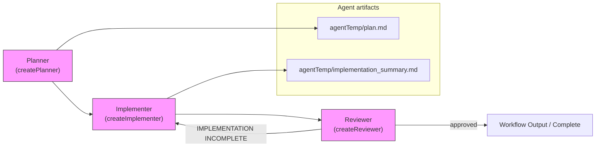

# Plan → Implement → Review Workflow

This repository includes a Plan → Implement → Review workflow implemented in
`src/workflow/plan_implement_review.py`. Below is a Mermaid diagram that
illustrates the high-level flow between the planner, implementer, and reviewer
agents.



Quick notes:

- The `Planner` creates `agentTemp/plan.md` (a checklist of tasks).
- The `Implementer` reads `agentTemp/plan.md`, implements tasks, and writes
  `agentTemp/implementation_summary.md` when finished.
- The `Reviewer` compares the plan and implementation; if incomplete it loops
  back to the implementer, otherwise it yields the final output.

Run the workflow locally:

```bash
python src/workflow/plan_implement_review.py "Implement the feature described in the spec"
```

See the workflow implementation in [src/workflow/plan_implement_review.py](src/workflow/plan_implement_review.py#L1).
