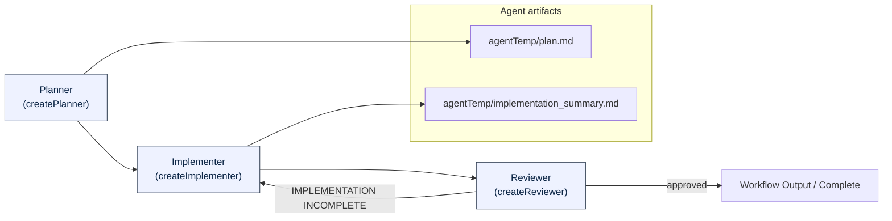

# Plan → Implement → Review Workflow

This repository includes a Plan → Implement → Review workflow implemented in
`src/workflow/plan_implement_review.py`. Below is a Mermaid diagram that
illustrates the high-level flow between the planner, implementer, and reviewer
agents.



Quick notes:

- The `Planner` creates `agentTemp/plan.md` (a checklist of tasks).
- The `Implementer` reads `agentTemp/plan.md`, implements tasks, and writes
  `agentTemp/implementation_summary.md` when finished.
- The `Reviewer` compares the plan and implementation; if incomplete it loops
  back to the implementer, otherwise it yields the final output.
- The reviewer-implementer loop is limited to a maximum number of iterations (default: 5) to prevent infinite loops. You can override this by setting the `MAX_REVIEW_ITERATIONS` environment variable.

Run the workflow locally:

```bash
python src/workflow/plan_implement_review.py "Implement the feature described in the spec"
```

### Configuring Maximum Review Iterations

To prevent infinite loops, the reviewer-implementer cycle is limited to a maximum number of iterations (default: 5). You can override this by setting the `MAX_REVIEW_ITERATIONS` environment variable:

```bash
export MAX_REVIEW_ITERATIONS=3
python src/workflow/plan_implement_review.py "Implement the feature described in the spec"
```

If the maximum is reached and the implementation is still incomplete, the workflow will yield a warning and output the last review feedback, listing any remaining incomplete tasks.

See the workflow implementation in [src/workflow/plan_implement_review.py](src/workflow/plan_implement_review.py#L1).
